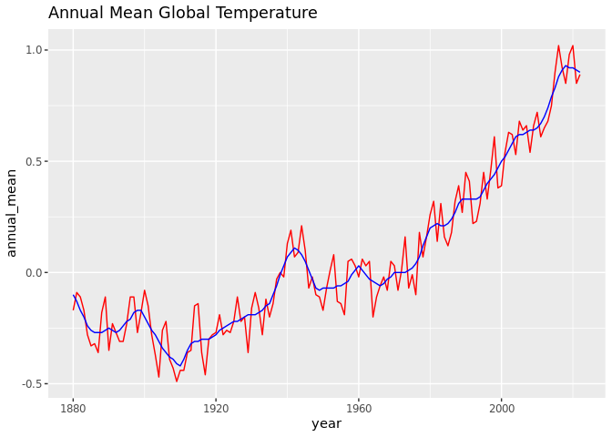

Changing Climate Indicators
================
Maeve Gilbert & Russell Huang

# Unit I: Climate Change Module

## Introduction: Examining CO2 trends in R

- Example from <http://climate.nasa.gov/vital-signs/carbon-dioxide/>
- Raw data from
  <https://gml.noaa.gov/webdata/ccgg/trends/co2/co2_mm_mlo.txt>

``` r
library(tidyverse)
```

``` r
co2 <- 
read_table("https://gml.noaa.gov/webdata/ccgg/trends/co2/co2_mm_mlo.txt", 
                  comment="#",
                  col_names = c("year", "month", "decimal_date", "monthly_average",
                                "interpolated", "days", "std", "uncertainty"),
                  na = c("-1", "-9.99", "-0.99"),
           col_types = "iidddddd")
co2
```

    ## # A tibble: 786 × 8
    ##     year month decimal_date monthly_average interpolated  days   std uncertainty
    ##    <int> <int>        <dbl>           <dbl>        <dbl> <dbl> <dbl>       <dbl>
    ##  1  1958     3        1958.            316.         314.    NA    NA          NA
    ##  2  1958     4        1958.            317.         315.    NA    NA          NA
    ##  3  1958     5        1958.            318.         315.    NA    NA          NA
    ##  4  1958     6        1958.            317.         315.    NA    NA          NA
    ##  5  1958     7        1959.            316.         315.    NA    NA          NA
    ##  6  1958     8        1959.            315.         316.    NA    NA          NA
    ##  7  1958     9        1959.            313.         316.    NA    NA          NA
    ##  8  1958    10        1959.            312.         315.    NA    NA          NA
    ##  9  1958    11        1959.            313.         315.    NA    NA          NA
    ## 10  1958    12        1959.            315.         315.    NA    NA          NA
    ## # ℹ 776 more rows

``` r
co2|> pivot_longer(c("monthly_average", "interpolated"), values_to="co2", names_to="type")|>
ggplot(aes(x = decimal_date, y = co2, col=type)) +
  geom_line()+ theme_bw()+
  ggtitle("Atmospheric CO2 Concentrations at the Mauna Loa Observatory ")
```

<!-- -->

This data represents the monthly observations of atmospheric CO2
concentrations in parts per million (ppm) collected from the Mauna Loa
Observatory in Hawaii. The data ranges from 1958 to the present. CO2
values fluctuate throughout the year as CO2 uptake increases during the
growing months of spring and summer and is released again through
decomposition in the fall and winter. The overall CO2 concentrations
appear to be steadily increasing and is currently around 425 ppm.

------------------------------------------------------------------------

# Section I: Temperature Data

Each of the last years has consecutively set new records on global
climate. In this section we will analyze global mean temperature data.

Data from: <http://climate.nasa.gov/vital-signs/global-temperature>

## Description of the Data:

The measurements displayed are collected from NASA’s Goddard Institute
Institute for Space studies. The data includes the global average
surface temperature from 1880 to 2022. The measurements are made as the
change in surface temperature compared to the global average from 1951
to 1980. The measurement uncertainty is Lowess smoothing, which averages
the data. The data is measured in annual mean temperature in Celsius.
The only obvious gap in data is temperature data pre-1880, since global
measurements of temperature were not consistently available.

## Temperature Data Table:

Data from:
<http://climate.nasa.gov/system/internal_resources/details/original/647_Global_Temperature_Data_File.txt>

``` r
global_temp<-
read_table("https://data.giss.nasa.gov/gistemp/graphs/graph_data/Global_Mean_Estimates_based_on_Land_and_Ocean_Data/graph.txt",
           skip=5, 
           col_names= c("year", "annual_mean", "lowess_smoothing"),
           show_col_types=FALSE)

global_temp
```

    ## # A tibble: 143 × 3
    ##     year annual_mean lowess_smoothing
    ##    <dbl>       <dbl>            <dbl>
    ##  1  1880       -0.17            -0.1 
    ##  2  1881       -0.09            -0.13
    ##  3  1882       -0.11            -0.17
    ##  4  1883       -0.17            -0.2 
    ##  5  1884       -0.28            -0.24
    ##  6  1885       -0.33            -0.26
    ##  7  1886       -0.32            -0.27
    ##  8  1887       -0.36            -0.27
    ##  9  1888       -0.18            -0.27
    ## 10  1889       -0.11            -0.26
    ## # ℹ 133 more rows

## Temperature Data Graph:

``` r
ggplot(global_temp, aes(x=year))+
         geom_line(mapping=aes(y=annual_mean), col="red")+
         geom_line(mapping=aes(y=lowess_smoothing), col="blue")+
         ggtitle("Annual Mean Global Temperature")
```

<!-- -->

This graph plots the the annual mean temperature from 1880 to the
present. The red line represents the annual mean temperature, while the
blue line represents the values with Lowess smoothing. The data
fluctuates consistently between 1880 to around 1910, generally
decreasing. However, at around 1930, the mean temperature variation
sharply increased, likely due to increased CO2 emissions from
intensified production during the two world wars. Greater CO2 emissions
led to a stronger greenhouse effect, which therefore increased the
global mean temperature. After this period, the annual mean temperature
continued increasing.

# Section 2: Melting Ice Sheets

- Data description: <http://climate.nasa.gov/vital-signs/land-ice/>
- Raw data file:
  <http://climate.nasa.gov/system/internal_resources/details/original/499_GRN_ANT_mass_changes.csv>

## Description of the Data:

The following data set represents the amount Antarctic and Greenland ice
mass per year. The mass of the ice is measured in gigatons per year. The
columns are year, Antarctic mass, and Greenland ice mass. The data comes
from NASA’s GRACE and GRACE follow-on satellites. There are some missing
values in the data, ranging from around June of 2017 to June of 2018
after the first GRACE mission was ended. It resumed in 2018 when the
GRACE Follow-On mission began. The data was collected monthly between
2002 to the present day.

## Data Tables:

``` r
ice_original <- read_csv("http://climate.nasa.gov/system/internal_resources/details/original/499_GRN_ANT_mass_changes.csv",
                skip=10,
                col_names=c("decimal_date", "greenland_mass", "antarctic_mass"),
                col_types="ddd")
                
          
ice_original
```

    ## # A tibble: 140 × 3
    ##    decimal_date greenland_mass antarctic_mass
    ##           <dbl>          <dbl>          <dbl>
    ##  1        2002.          1491.           967.
    ##  2        2002.          1486.           979.
    ##  3        2003.          1287.           512.
    ##  4        2003.          1258.           859.
    ##  5        2003.          1257.           694.
    ##  6        2003.          1288.           592.
    ##  7        2003.          1337.           658.
    ##  8        2003.          1354.           477.
    ##  9        2003.          1363.           546.
    ## 10        2003.          1427.           494.
    ## # ℹ 130 more rows

``` r
ice_new<-ice_original%>%
  pivot_longer(greenland_mass:antarctic_mass, values_to="ice_mass", names_to="location")
ice_new
```

    ## # A tibble: 280 × 3
    ##    decimal_date location       ice_mass
    ##           <dbl> <chr>             <dbl>
    ##  1        2002. greenland_mass    1491.
    ##  2        2002. antarctic_mass     967.
    ##  3        2002. greenland_mass    1486.
    ##  4        2002. antarctic_mass     979.
    ##  5        2003. greenland_mass    1287.
    ##  6        2003. antarctic_mass     512.
    ##  7        2003. greenland_mass    1258.
    ##  8        2003. antarctic_mass     859.
    ##  9        2003. greenland_mass    1257.
    ## 10        2003. antarctic_mass     694.
    ## # ℹ 270 more rows

``` r
ice_new %>%
  ggplot()+
  geom_line(aes(x=decimal_date, y=ice_mass, color=location))+
  ggtitle("Greenland and Antarctic Ice Mass")
```

<!-- -->

The above data is listed as a table listing data by the year with both
Greenland and Antarctic ice mass. It is then listed again as a
consolidated table in order to plot the data in one graph. Both
locations on the plot display small seasonal variations in ice mass as
ice melts in the spring and reforms in the winter. However, both
locations display an overall decline in ice mass. The Greenland ice mass
appears to follow a fairly regular decline, while the Antarctic ice mass
data has greater variation. Additionally, the rate of change for the
Greenland ice is almost twice as fast as that of the Antarctic ice.

# Section 3: Sea Level Rise

- Data description: <http://climate.nasa.gov/vital-signs/sea-level/>
- Raw data file:
  <http://climate.nasa.gov/system/internal_resources/details/original/121_Global_Sea_Level_Data_File.txt>

## Data Description:

The following table measures the Global Mean Sea Level (GMSL) variation
measured in millimeters every month from 1993 until the present. The
data was gathered by the NASA Goddard Space Flight Center and represents
a compilation of the Sea Surface Heights from multiple satellites. The
original data file contains twelve different columns, including the
year, number of observations, weighted observations, and multiple GMSL
measurements with different filters applied. For the purposes of our
observations, we used the data on the time that the observation was
collected, and the the smoothed GMSL variation with the annual and
semi-annual signal removed. We chose this data column because it was the
same as that used by NASA in their figures.

## Data Table:

``` r
sea_level<-read_table("http://climate.nasa.gov/system/internal_resources/details/original/121_Global_Sea_Level_Data_File.txt",

                      skip=30,
                      comment="HDR",
                      col_names=c("a", "b", "decimal_date","c", "d",
                      "e", "f", "g", "h", "i", "j", "height_variation"),
                      show_col_types=FALSE)
sea_level<-select(sea_level, decimal_date, height_variation)
sea_level
```

    ## # A tibble: 847 × 2
    ##    decimal_date height_variation
    ##           <dbl>            <dbl>
    ##  1        1993.           -14.1 
    ##  2        1993.           -14.7 
    ##  3        1993.           -14.2 
    ##  4        1993.           -14.2 
    ##  5        1993.           -13.0 
    ##  6        1993.           -11.8 
    ##  7        1993.           -10.6 
    ##  8        1993.            -9.73
    ##  9        1993.            -9.12
    ## 10        1993.            -8.76
    ## # ℹ 837 more rows

## Sea Level Graph:

``` r
ggplot(data=sea_level)+
geom_line(mapping=aes(x=decimal_date, y=height_variation), color="orange")+
  ggtitle("Sea Level Variation")
```

<!-- -->

This plot displays the variation in sea level height from a period from
1993 to 2016. The height variation trends upwards, with small seasonal
variations. These can possibly be attributed to changes in sea ice mass,
as greater ice mass will lower sea level, while more ice melt will raise
it.

# Section 4: Melting Arctic Sea Ice

- Data from: <http://nsidc.org/data/G02135>
- Raw data file:
  <ftp://sidads.colorado.edu/DATASETS/NOAA/G02135/north/daily/data/N_seaice_extent_daily_v3.0.csv>

## Data description:

This data set represents the amount of Arctic sea ice from 1978 to the
present. The temporal resolution is 1 day, and the spatial resolution is
25 by 25 km. The data is collected from various sensors operated by the
National Snow and Ice Data Center. However, it should be noted that the
data is best observed on a monthly scale rather than daily because
monthly averages will smooth errors in the data and represent long-term
weather more accurately than daily weather variations. For this table,
the column titled “extent” contains the data for the amount of sea ice
present at each observation, which is defined by the year, month, and
day of the month that the observation was taken.

## Arctic Ice Data Table:

``` r
arctic_ice <- read_csv("ftp://sidads.colorado.edu/DATASETS/NOAA/G02135/north/daily/data/N_seaice_extent_daily_v3.0.csv",
                     skip=2,
                     col_names=c("year", "month", "day", "extent", "missing",
                                 "source"),
                     col_types= c("iiiddc"))
arctic_ice
```

    ## # A tibble: 14,747 × 6
    ##     year month   day extent missing source                                      
    ##    <int> <int> <int>  <dbl>   <dbl> <chr>                                       
    ##  1  1978    10    26   10.2       0 ['/ecs/DP1/PM/NSIDC-0051.001/1978.10.26/nt_…
    ##  2  1978    10    28   10.4       0 ['/ecs/DP1/PM/NSIDC-0051.001/1978.10.28/nt_…
    ##  3  1978    10    30   10.6       0 ['/ecs/DP1/PM/NSIDC-0051.001/1978.10.30/nt_…
    ##  4  1978    11     1   10.7       0 ['/ecs/DP1/PM/NSIDC-0051.001/1978.11.01/nt_…
    ##  5  1978    11     3   10.8       0 ['/ecs/DP1/PM/NSIDC-0051.001/1978.11.03/nt_…
    ##  6  1978    11     5   11.0       0 ['/ecs/DP1/PM/NSIDC-0051.001/1978.11.05/nt_…
    ##  7  1978    11     7   11.1       0 ['/ecs/DP1/PM/NSIDC-0051.001/1978.11.07/nt_…
    ##  8  1978    11     9   11.2       0 ['/ecs/DP1/PM/NSIDC-0051.001/1978.11.09/nt_…
    ##  9  1978    11    11   11.3       0 ['/ecs/DP1/PM/NSIDC-0051.001/1978.11.11/nt_…
    ## 10  1978    11    13   11.5       0 ['/ecs/DP1/PM/NSIDC-0051.001/1978.11.13/nt_…
    ## # ℹ 14,737 more rows

## Arctic Ice Graph:

``` r
arctic_ice |>
  group_by(year) |>
  summarise(mean_extent = mean(extent)) |>
  ggplot(aes(year, mean_extent)) + geom_line()+
  ggtitle("Arctic Sea Ice Extent")
```

<!-- -->

In general, there is an overall decrease in Arctic sea ice surface area.
However, there are fluctuations in the data which could be attributed to
fluctuations in global climate. For example, the past ten years have
been some of the hottest on record. These higher temperatures would mean
more sea ice would melt, contributing to these sharp decreases in mean
ice extent. There also seems to be a sharp increase in the amount of sea
ice in the past three years. We are uncertain as to the reason for this
increase.

# Section 5: Paleoclimatic CO2 Records

The previous sections explored climatic data from relatively recent time
scales. In order to determine whether these climatic fluctuations are
part of a longer-term pattern or if they simply represent insignificant
change, it is necessary to examine historical climatic records. The
Vostok ice core provides data of the composition of the atmosphere
dating back 400,000 years and can provide a record against which we can
compare current trends. However, examining a data set of this size can
be difficult. For the purposes of this report, we examined ice core data
dating back to 163,670 years before the present day.

Data file:
<https://www.ncei.noaa.gov/pub/data/paleo/icecore/antarctica/vostok/co2-noaa.txt>

## Description of the Data:

The data set we found includes the depth of the measurement, the age of
the ice in years before present (BP), the age of the gas (BP), and the
minimum, maximum, and mean CO2 concentration values. These measurements
are all from the Vostok core in Antarctica and represents climatic data
from the last 160,000 years, with the latest date being 1700 BP.
According to the NCEI, the data fluctuates in accordance with glacial
and interglacial cycles, with a shorter term CO2 cyclical period of
around 21,000 years.

# Vostok Core Data Table

``` r
vostok<- read_table("https://www.ncei.noaa.gov/pub/data/paleo/icecore/antarctica/vostok/co2-noaa.txt",
                  comment="#", 
                  skip=4,
                  show_col_types=FALSE)%>%
                  arrange(desc(gas_ageBP))
vostok
```

    ## # A tibble: 65 × 6
    ##    depth_m ice_ageBP gas_ageBP CO2_mean CO2_max CO2_min
    ##      <dbl>     <dbl>     <dbl>    <dbl>   <dbl>   <dbl>
    ##  1   2078.    163670    159690     196.    202.    190.
    ##  2   2050.    159100    154970     191.    199.    184.
    ##  3   2026.    154980    150700     200.    208.    192.
    ##  4   1998     150330    146340     191     209     187 
    ##  5   1975.    146860    143370     217     221     213 
    ##  6   1949.    143440    140430     231     251     224 
    ##  7   1928     141170    138410     246.    264.    236.
    ##  8   1902     138660    136170     266     270     262 
    ##  9   1876.    136450    134170     296.    304.    284.
    ## 10   1850.    134510    132280     266     285     260 
    ## # ℹ 55 more rows

# Vostok Ice Core CO2 Concentrations

``` r
vostok %>%
  ggplot()+
  geom_line(aes(x=gas_ageBP, y=CO2_mean))+
  scale_x_reverse()+
  ggtitle("Vostok CO2 Concentrations")
```

<!-- -->

As stated above, the data from the Vostok core fluctuates in accordance
with glacial and interglacial cycles, which help explain the variation
in CO2 concentrations. This 100,000 year cycle is superimposed on a
shorter cycle of CO2 fluctuations which occurs over a 21,000 year
period. The age of the gas is represent on the x-axis as years before
present, arranged so that the most recent year, around 1700 BP, is
furthest to the right. The oldest measurements, therefore, are furthest
on the left. A direct comparison of this data to observations recorded
at the Mauna Loa Observatory is not possible given the data available,
since the classification of time, mainly the system used to measure
years, is different. However, the increase in CO2 concentrations in both
graphs is apparent. While it may be difficult to determine more recent
CO2 increases in the Vostok data, the Mauna Loa graph clearly represents
recent increases in CO2.

# Concluding Observations

The data sets analyzed here represent several indicators of climate
change. Overall, we observed increases in atmospheric CO2, increased
global mean temperature, decreased Antarctic and Greenland ice, higher
sea levels, and decreases in Arctic sea ice. Together, these trends
point towards larger-scale changes in climate patterns. Although we do
not have a comprehensive set of data here, these markers are typically
used as evidence that anthropogenic CO2 emissions contribute to global
warming due to the greenhouse effect. Although there are small seasonal
variations in some of the measurements, they still display an overall
trend towards a warmer climate.
